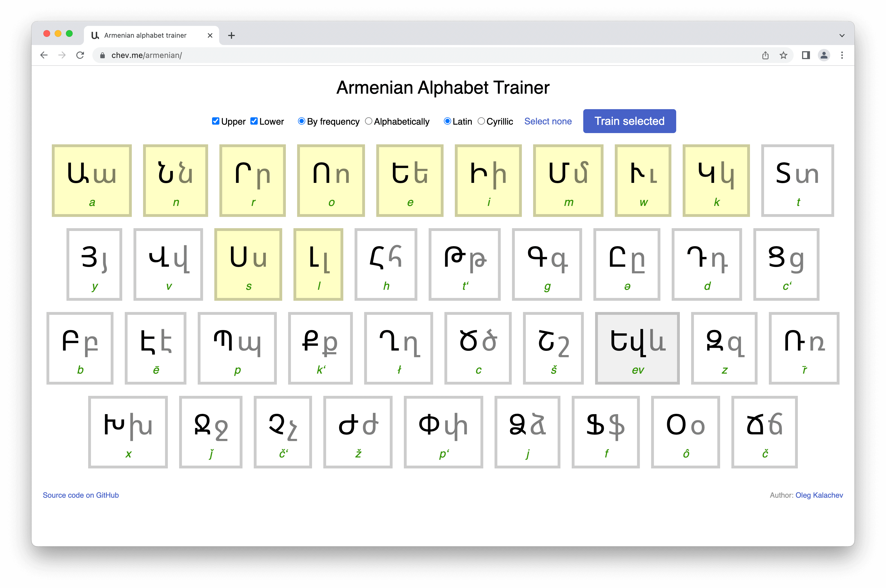

# Armenian alphabet

Trainer for Armenian alphabet.

Useful for those who want to get some kind of understanding of street signs, billboards, etc., while being in Armenia.

## Sources

* Letters frequency: http://simia.net/letters/, http://simia.net/letters/unigrams.zip
* Latin transliteration: https://en.wikipedia.org/wiki/Armenian_alphabet
* Cyrillic transliteration: http://lingvisto.org/arm/alfabeto.html
